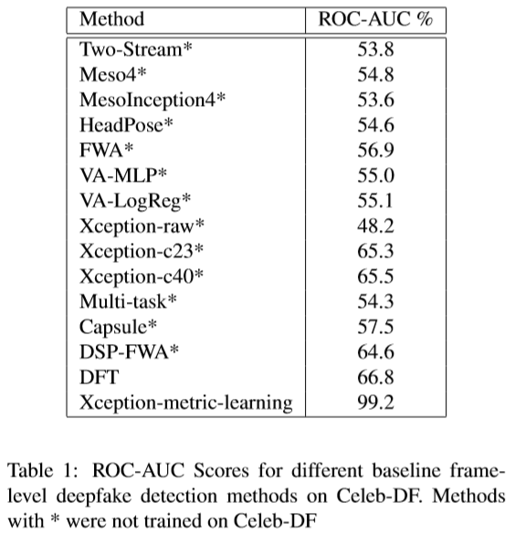

# Deepfake-Detection using Spatiotemporal Convolutional Networks

## Overview
This repo contains code for the different spatiotemporal methods used to detect deepfake videos on the Celeb-DF dataset. All convolutional network methods were implemented in PyTorch and were trained on the Celeb-DF v2 dataset. The networks implemented are:
* RCN
* R3D
* MC3
* R2Plus1D
* I3D

We also investigate one non-temporal classification method that is DFT based.

## Results
The ROC_AUC curve and Test accuracies for different methods are shown below. Our methods outperformed state-of-the-art frame based methods for Deepfake classification.

The power spectra informations for real and fake images in the Celeb-DF dataset is shown below.

