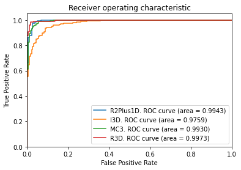
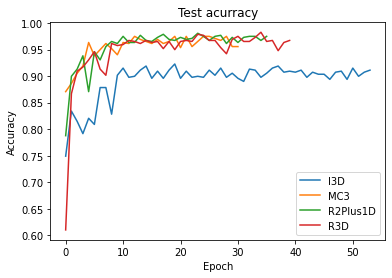

# Deepfake-Detection using Spatiotemporal Convolutional Networks

## Overview
This repo contains code for the different spatiotemporal methods used to detect deepfake videos on the Celeb-DF dataset. All convolutional network methods were implemented in PyTorch and were trained on the Celeb-DF v2 dataset. The networks implemented are:
* RCN
* R3D
* MC3
* R2Plus1D
* I3D

We also investigate one non-temporal classification method that is DFT based.

## Results
The ROC_AUC curve and Test accuracies for different methods are shown below. Our methods outperformed state-of-the-art frame based methods for Deepfake classification.
ROC Curves           |  Test Accuracies
:-------------------------:|:-------------------------:
 |  

Best test ROC-AUC Scores and Accuracies for the spatio-temporal  convolutional  methods  trained  on  Celeb-DF:
 

The power spectra informations for real and fake images in the Celeb-DF dataset (as obtained from the DFT method) is shown below.
 

## Acknowledgements

Celeb-DF V2 Dataset: http://www.cs.albany.edu/~lsw/celeb-deepfakeforensics.html
 
RetinaFace: https://github.com/biubug6/Pytorch_Retinaface  
I3D Implementation: https://github.com/piergiaj/pytorch-i3d  
RCN Implementation: https://github.com/chinmay5/FakeDetection

